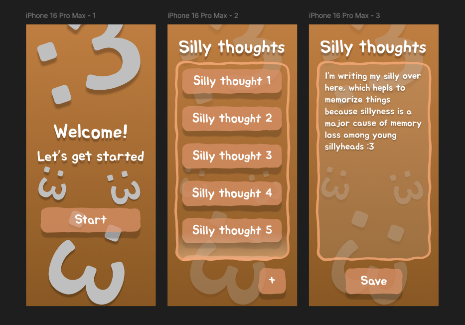
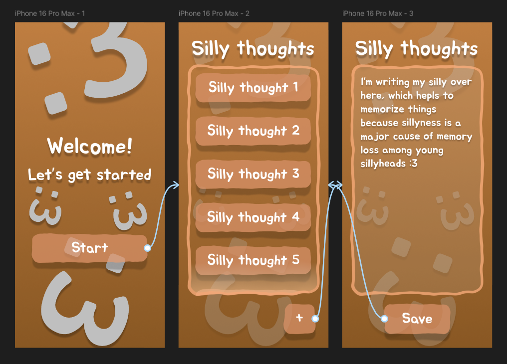
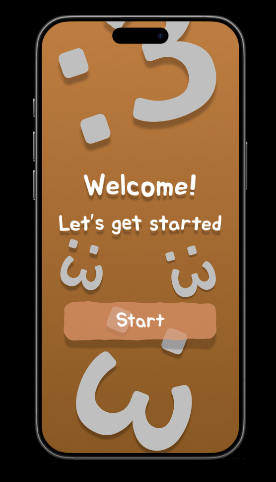
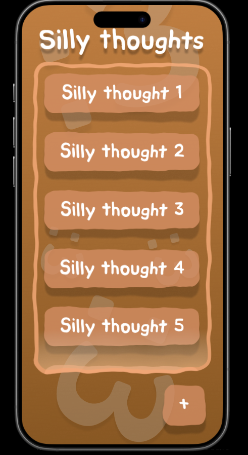
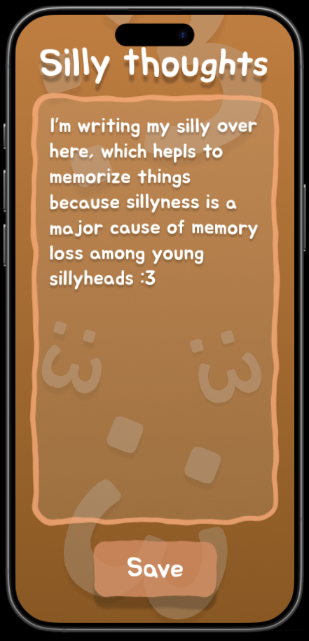

# Горшков Г.А. ЭФБО-10-23
(ура деанон в интернете :3)
## Скриншот в режиие Design:

## Скриншот в режиме Prototype:

## Скриншоты в режиме Present:

## Текстовый отчёт:
- Создан стартовый экран, экран с заметками и экран для создания заметок
- Использовалось много глупых элементов интерфейса, а так же прямоугольники и текст
- Навигация организована нажатием глупых кнопок расположенных на экране
### Краткий анализ:
- Получился довольно удобный глупый интерфейс, улучшить в нём можно переходы, сделав их кастомными